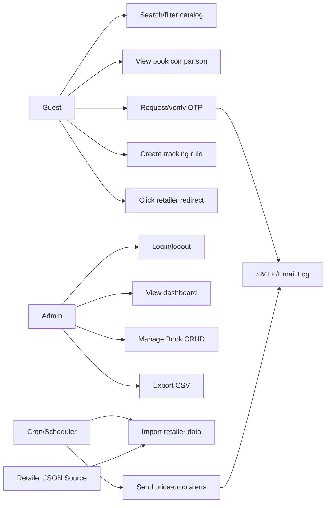
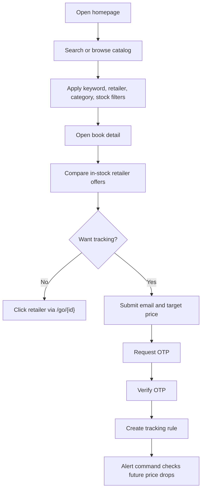
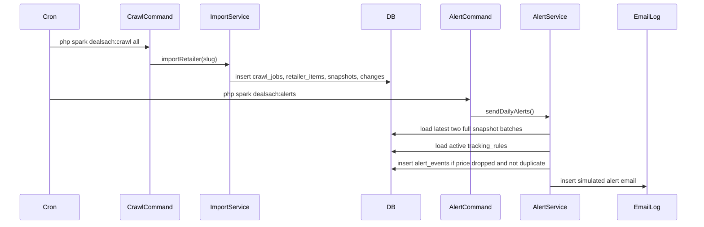
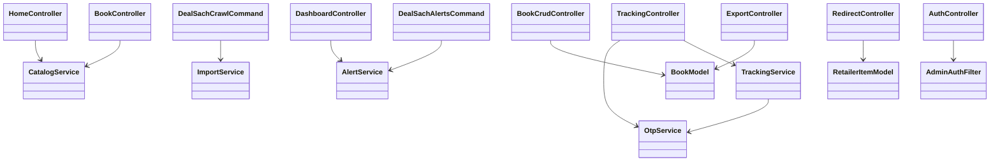
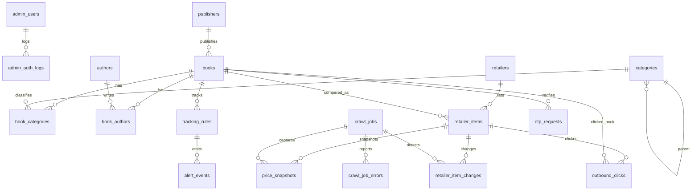
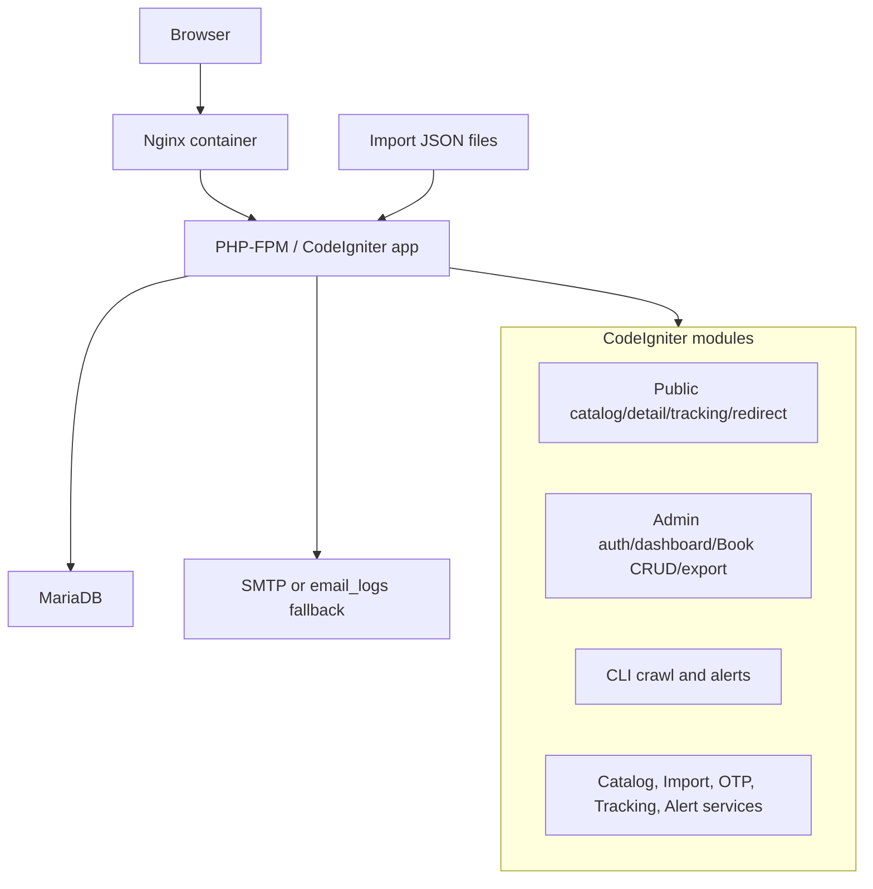
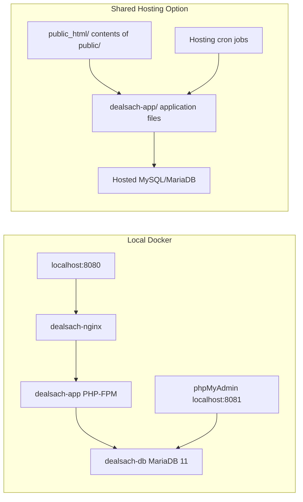

# DealSach UML Package

These diagrams match the implemented CodeIgniter 4 application, routes, services, commands, and 19-table schema.

## 1. Use Case Diagram

## 2. Activity Diagram

## 3. Sequence Diagram

## 4. Class Diagram

## 5. ERD

## 6. Component Diagram

## 7. Deployment Diagram

